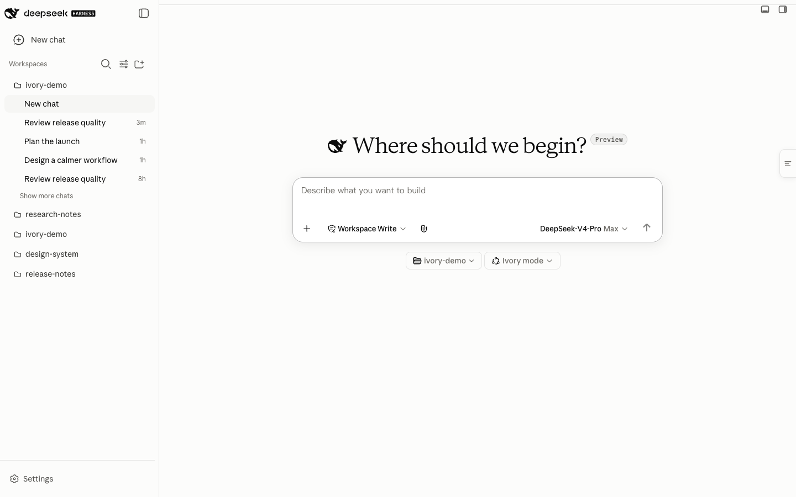
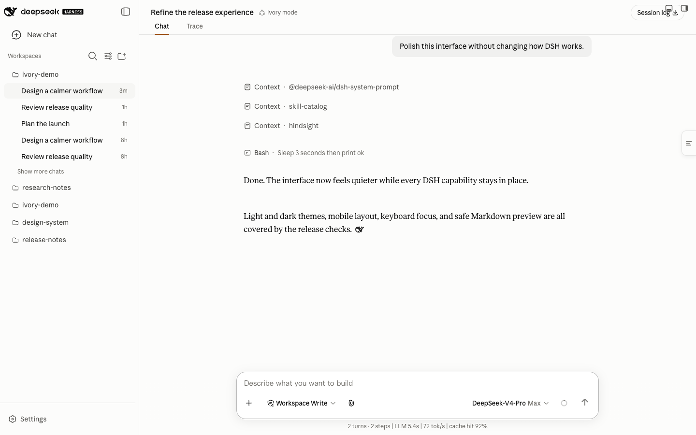
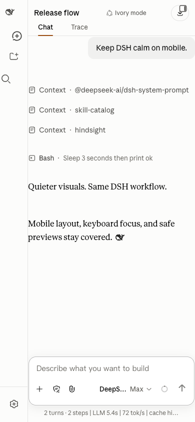

# Ivory for DSH

> A calm, Claude-inspired interface for DeepSeek Harness — responsive, accessible, and intentionally boring about your data.

[简体中文](README.zh-CN.md)

[](https://github.com/ZJUZhiyuCai/dsh-ivory/actions/workflows/ci.yml)
[](https://www.npmjs.com/package/dsh-ivory)
[](LICENSE)
[](package.json)
[](package.json)

<picture>
  <source media="(prefers-color-scheme: dark)" srcset="assets/hero-dark.png">
  
</picture>

Ivory reshapes the DSH web interface with a warm neutral palette, editorial
typography, restrained shadows, and a focused conversation layout. It keeps
the DeepSeek identity and every DSH capability intact, with zero telemetry.

## Install

Install the published package (recommended):

```sh
dsh plugin --profile web add dsh-ivory
dsh web
```

To pin the exact GitHub release without using npm:

```sh
dsh plugin --profile web add github:ZJUZhiyuCai/dsh-ivory#v0.2.0
```

Hard-refresh the browser after installation (`Cmd/Ctrl + Shift + R`). Open
**Settings → Ivory Theme** to enable the theme or its optional focus mode.

To uninstall:

```sh
dsh plugin --profile web remove dsh-ivory
```

## What makes it different

- **Complete light and dark themes** — follows the active DSH appearance.
- **Responsive by contract** — tested at 375, 768, 1,440, and 1,920 pixels.
- **Accessible interaction states** — visible keyboard focus without the blue
  composer halo, reduced-motion support, and forced-colors fallbacks.
- **Safe Markdown document preview** — builds DOM nodes instead of injecting
  HTML, permits only HTTP(S) links, and keeps source view reachable.
- **Independent block copying** — prose paragraphs, user bubbles, and code
  fences have their own accessible copy control with a clipboard fallback.
- **Native bilingual settings** — settings, copy feedback, and document-preview
  controls follow DSH's English or Simplified Chinese locale.
- **Symmetric cleanup** — observers, injected views, and the small ink-colored
  whale marker are removed when the theme is disabled.
- **Host-friendly compatibility mode** — if an upstream selector changes,
  structural enhancements fall back while stable design tokens remain active.



<p align="center">
  
</p>

## Trust model

Ivory is a visual client plugin. Its host entry point is deliberately inert.

| Surface | Behavior |
| --- | --- |
| Bundled runtime dependencies | None; DSH client modules and React are declared as peers |
| Host filesystem/process access | None |
| Network requests or telemetry | None |
| Persistent data | Two local `localStorage` preference flags |
| Bundled Anthropic assets | None; platform font stacks only |
| User content handling | In-browser presentation; explicit copy clicks write only to the local clipboard |

The generated npm tarball is allowlisted to eight files and checked in CI.
See [SECURITY.md](https://github.com/ZJUZhiyuCai/dsh-ivory/blob/main/SECURITY.md) and [the architecture note](https://github.com/ZJUZhiyuCai/dsh-ivory/blob/main/docs/ARCHITECTURE.md)
for the exact boundary.

## Quality gates

The repository has two verification layers:

```sh
npm ci
npm test          # reproducible build, static security checks, publint, tarball audit
npm run qa:r2     # 69 browser regressions; requires DSH at 127.0.0.1:3080
```

The browser suite covers layout contracts, mobile overflow, composer focus,
Markdown injection attempts, lifecycle cleanup, streaming state, whale marker
timing, exact block-copy payloads and fallback, dark mode, plugin coexistence,
long tables, and reduced motion.

## Development

```sh
npm ci
npm run build

# Link the local checkout into DSH
dsh plugin --profile web add link:$PWD
dsh web
```

Edit `src/skin.css` and `src/client.template.js`, then run `npm run build`.
`lib/client.js` is committed so GitHub installs do not need a build script.

```text
src/skin.css             theme and compatibility styles
src/client.template.js   client lifecycle and optional enhancements
lib/client.js            deterministic generated browser bundle
lib/index.js             inert host entry point
cordis.patch.yml         DSH bundle registration
scripts/                 build and verification gates
```

Please read [CONTRIBUTING.md](https://github.com/ZJUZhiyuCai/dsh-ivory/blob/main/CONTRIBUTING.md) before opening a pull request.

## Compatibility and limitations

DeepSeek Harness is currently a developer preview and can make breaking UI
changes. Ivory validates the structural selector contract at runtime and
degrades to token-only styling when it cannot prove compatibility. System font
metrics differ slightly across macOS, Windows, and Linux. Focus mode temporarily
hides supported auxiliary panels by design; it is off by default. Release 0.2.0
is verified against DSH 0.1.0-rc.6.

## Project status

The initial release focuses on a small, auditable surface. Planned work is
tracked in [GitHub Issues](https://github.com/ZJUZhiyuCai/dsh-ivory/issues).
If Ivory improves your daily DSH workflow, a star helps other users find it.

## Independence and trademarks

Ivory is an **unofficial**, independent community project. It is not affiliated
with, endorsed by, or sponsored by Anthropic or DeepSeek. Claude is a trademark
of Anthropic PBC. DeepSeek and DeepSeek Harness may be trademarks of their
respective owners. Ivory does not bundle Anthropic fonts, logos, icons, or code.
See [THIRD_PARTY_NOTICES.md](THIRD_PARTY_NOTICES.md).

Released under the [MIT License](LICENSE).
